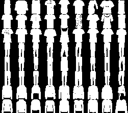

## Introduction
This repository presents a machine learning solution for classifying Fashion MNIST dataset.

Fashion MNIST dataset contains 70,000 examples of 28x28 grayscale images of garment, each labelled with one of the ten
categories. Examples have been split into two groups, 1) test set with 10 000 elements, 2) training set with 60 000
elements.

A target algorithm would predict labels of images in test set, after training with labeled training set. Quality of an
algorithm can be measured in terms of its accuracy; that is, the ratio of correct classifications to the number
of all classifications.

## Methods
I considered two models for completing this task, 1) *k*-nearest neighbors classifier, 2) convolutional neural network.

### *k*-nearest neighbors
The *k*-nearest neighbors (k-NN) is a non-parametric algorithm that labels new objects based on labels of *k* most
similar training objects.

As a measure of similarity, depending on features, I used
[Euclidean distance](https://en.wikipedia.org/wiki/Euclidean_distance) or
[Hamming distance](https://en.wikipedia.org/wiki/Hamming_distance). Euclidean distance is the length of a line segment
between two points in Euclidean space and thus allows for object features to be any  real numbers. If all features are
binary, Hamming distance can be used.

#### Thresholding as feature extraction
Even though it is not necessary, I tested thresholding as a feature extraction method and compared the results with
no feature extraction.

In the thresholding process, every pixel's brightness is replaced with 0, if its brightness (represented by an
integer from 0 to 255) is lower than some constant T, or 1 otherwise.

Motivation for using thresholding in the feature extraction process is that the category of a piece of clothing is
primarily designated by its shape rather than its color. Thresholding removes information about specific shade of
presented garment, effectively leaving only information about its shape.

Following figure present a subset of 72 samples from the Fashion MNIST dataset before and after applying thresholding
T=10.

### Convolutional neural network
I tested several convolutional neural networks and noted the best two of them below. Convolutional neural networks
are a subclass of neural networks that consist of feature extraction layers and classification layers. The latter part
is simply a multilayer perceptron. In feature extraction layers, initial vector is split into a set of feature maps
of the image and thus there is no need to perform any additional feature extraction beforehand.

I decided to use convolutional neural networks because they are known to have great performance in image classification
problems. Following figure presents one of the architectures of CNN that I mention in the Results section, where it is
labeled as *CNN (1)*.

 architecture")

Architectures of both presented networks, including the one visualized above, are also described in Appendix A.

## Results
### Tests
| Method		| Parameters									| Preprocessing									| Features (before convolutions)		| Accuracy
| ----			| ----											| ----											| ----									| ----
| CNN (1)		| 3 Conv, kernel size (3, 4), ~3.4M parameters	| Random flip and translation, rescaling		| 784x1 [0..1] pixels, single channel	| 0.9239
| CNN (2)		| 2 Conv, kernel size (5, 5), ~879K parameters	| Random flip and translation, rescaling		| 784x1 [0..1] pixels, single channel	| 0.9100
| k-NN			| k=7, Hamming distance, uniform weights		| Thresholding T=10								| 784x1 [0..1] binary pixels			| 0.8634
| k-NN			| k=7, Hamming distance, uniform weights		| Thresholding T=13								| 784x1 [0..1] binary pixels			| 0.8608
| k-NN			| k=7, Hamming distance, uniform weights		| Thresholding T=4								| 784x1 [0..1] binary pixels			| 0.8572
| k-NN			| k=3, Euclidean distance, uniform weights		| None											| 784x1 [0..255] pixels, single channel	| 0.8527

### Benchmark
| Method		| Parameters									| Preprocessing									| Accuracy
| ----			| ----											| ----											| ----
| CNN			| 2 Conv, pooling								| Augmentation, batch normalization				| 0.9340
| k-NN			| k=5, Manhattan distance, distance weights		| -												| 0.8600

### Discussion
Applying thresholding to features in the *k*-nearest neighbors algorithm resulted in slightly higher accuracy than the
best benchmark classification with use of this algorithm.

In the case of the convolutional neural network, I did not manage to beat the benchmark, but the proposed network
CNN (1) is pretty close to it. Note that the benchmark used for comparison is not official; it was submitted to Zalando
Research and not confirmed by them.

## Usage
In order to reproduce the results, download or clone this repository and install requirements with `py -m pip install
-r requirements.txt` (or its equivalent on your machine) from within project's root directory. For presentation of
k-nearest neighbors algorithm, run `py main.py -knn`, and for presentation of convolutional neural network 1 or 2, run
`py main.py -cnn (1|2)`.

Python 3.9 is recommended. Repository already contains Fashion MNIST dataset, so additional files do not have to be put in
the project directory.

## Appendix A. Architectures of used convolutional neural networks
### CNN no 1
Layer type      	          	| Output shape        	| Param
----							| ----					| ----
Conv2D			             	| 26, 25, 32  			| 416
Conv2D         				  	| 24, 22, 64  			| 24 640
Conv2D          			 	| 22, 19, 128 			| 98 432
MaxPooling2D					| 11, 9, 128 			| 0
Dropout      			     	| 11, 9, 128 			| 0
Flatten       			    	| 12 672       			| 0
Dense          			     	| 256         			| 3 244 288
Dense          				   	| 128         			| 32 896
Dense      				       	| 10          			| 1 290

* Total params: 3 401 962
* Trainable params: 3 401 962
* Non-trainable params: 0

### CNN no 2
Layer type      	          	| Output shape        	| Param
----							| ----					| ----
Conv2D			             	| 24, 24, 32  			| 832 
Conv2D			             	| 20, 20, 64  			| 51 264
MaxPooling2D					| 10, 10, 64 			| 0
Flatten       			    	| 6 400       			| 0
Dense          				   	| 128         			| 819 328
Dropout      			     	| 128					| 0
Dense      				       	| 10          			| 1 290

* Total params: 872 714
* Trainable params: 872 714
* Non-trainable params: 0
